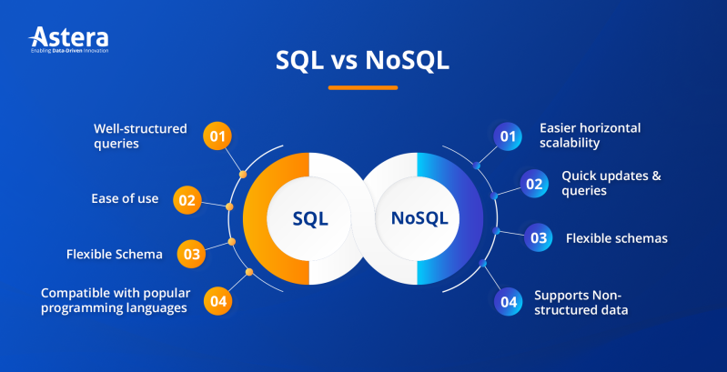
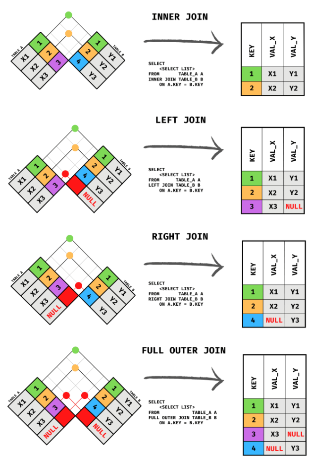

https://www.stefanjudis.com/snippets/how-to-import-json-files-in-es-modules-node-js/

## Install debug

npm i debug
npm i -D @types/debug

En las variables de entorno poner DEBUG=app\* para que sepa que estamos en modo depuración.

## Install express

npm install express
npm i -D @types/express

// uso de router
import { usersRouter } from './routers/users.routers.js';
...
app.use('/api/users', usersRouter);

// fichero ./routers/users.routers.ts
import { Router } from 'express';
import { UserController } from '../controllers/user.controller.js';

export const usersRouter = Router();
const userController = new UserController();

usersRouter.get('/', userController.readAll);
usersRouter.post('/', userController.create);

usersRouter.get('/:id', userController.read);
usersRouter.patch('/:id', userController.update);
usersRouter.delete('/:id', userController.delete);

## CORS

npm i cors
npm i -D @types/cors

## Errores

Middleware de 4 parámetros.

app.use ((err,req,res,next)=> {})
...
next (Error)

BBDD

Firebase: https://firebase.google.com/
Render: https://render.com/
Supa: https://supabase.com/

Configuración de PGadmin en supabase
https://supabase.com/docs/guides/database/pgadmin

https://www.astera.com/es/knowledge-center/sql-vs-nosql/

https://jorgesanchez.net/manuales/gbd/entidad-relacion.html

SQL Course
https://sqlbolt.com/lesson/select_queries_with_constraints

https://ingenieriadesoftware.es/tipos-sql-join-guia-referencia/

-- show databases;
drop database if exists demo;
create database demo;
use demo;
create table animals (
id char(18) primary key default(uuid()),
name varchar(50),
englishName varchar(50),
sciName varchar(50),
diet varchar(50),
lifestyle varchar(50),
location varchar(50),
slogan varchar(50),
aniGroup varchar(50),
image varchar(50),
create_at timestamp default(now()),
update_at timestamp default(now())
)
